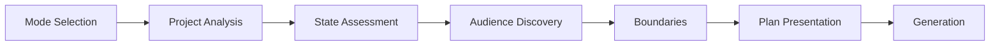

# Code Documenter

> Intelligent documentation generation system that analyzes codebases and creates comprehensive, reader-focused documentation. Use when you need to generate or update documentation for any project -- APIs, CLIs, libraries, web applications, or complex systems.

## Overview

The Code Documenter skill transforms Claude into a documentation specialist that doesn't just describe code -- it explains it for the people who need to use it. Operating on the principle that "documentation serves readers, not authors," every decision prioritizes reader understanding and success.

Unlike simple doc generators that extract comments and function signatures, this skill performs deep codebase analysis using five specialized agents, tracks documentation health over time, and adapts its output to different audiences and project types. It produces living documentation that stays current with your code and actually helps users accomplish their goals.

The skill operates in two modes: **Quick Mode** for efficient incremental updates after changes, and **Comprehensive Mode** for thorough analysis with human review gates when starting fresh or performing major overhauls.

## Quick Start

### Prerequisites

- Claude Code CLI or Claude.ai with skill upload capability
- A codebase that needs documentation
- Write access to create/modify files in the project

### Basic Usage

**For Claude Code**, reference the skill in your project's `CLAUDE.md`:

```markdown
## Skills

When documenting code, read and follow /path/to/claude-skills/code-documenter/SKILL.md.
```

**For Claude.ai**, upload the packaged `.skill` file via Settings > Skills.

**Sample prompts to begin:**

```text
I need comprehensive documentation for this project. Let's start fresh
and go through the full analysis process.
```

```text
I just added a new API endpoint. Update the docs in quick mode.
```

Claude will guide you through mode selection and analysis before generating documentation.

## Features

| Feature                           | Description                                                                                           |
| --------------------------------- | ----------------------------------------------------------------------------------------------------- |
| **Dual-mode operation**           | Quick mode for incremental updates; Comprehensive mode for full analysis with quality gates           |
| **Multi-agent analysis**          | Five specialized agents analyze structure, code surface, dependencies, git history, and existing docs |
| **Documentation health scoring**  | Four-component weighted score tracks coverage, freshness, quality, and consistency over time          |
| **Multi-audience support**        | Generates separate documentation for developers, users, or both                                       |
| **Depth levels**                  | Standard (4-7k words) or Deep (8-12k words) based on project complexity                               |
| **Project type detection**        | Adapts structure for APIs, CLIs, libraries, web apps, databases, monorepos                            |
| **Architecture Decision Records** | Captures the "why" behind technical decisions, not just the "what"                                    |
| **Living examples**               | Generates runnable code with test scripts that actually work                                          |
| **Mermaid diagrams**              | Creates version-controllable diagrams for architecture visualization                                  |
| **Troubleshooting database**      | Seeds common issues and solutions, grows with real problems                                           |
| **Documentation manifest**        | `.doc-state.json` tracks state, health history, and documentation debt                                |

## Modes

### Quick Mode vs. Comprehensive Mode

| Aspect               | Quick Mode                                        | Comprehensive Mode                                      |
| -------------------- | ------------------------------------------------- | ------------------------------------------------------- |
| **Best for**         | Incremental updates, feature additions, bug fixes | New projects, major overhauls, first-time documentation |
| **Analysis depth**   | Focused on changes since last update              | Full codebase analysis                                  |
| **User involvement** | Autonomous with status updates                    | Collaborative with approval gates                       |
| **Preferences**      | Uses stored preferences from previous runs        | Asks explicitly about audiences and depth               |
| **Manual edits**     | Preserves in unchanged sections                   | Fresh documentation with review                         |
| **Speed**            | Fast                                              | Thorough                                                |

### When to Use Each Mode

**Quick Mode:**

- After adding a new feature or endpoint
- Following bug fixes that affect behavior
- When updating dependencies
- For regular documentation maintenance

**Comprehensive Mode:**

- First time documenting a project
- Major version releases
- Significant architectural changes
- When documentation health score drops below 70

## Workflow

The skill follows a seven-phase session flow:



### Phase 1: Mode Selection

Claude asks whether you want Quick Mode (incremental) or Comprehensive Mode (full analysis). If a `.doc-state.json` manifest exists, Claude summarizes current health and recommends the appropriate mode.

### Phase 2: Multi-Agent Project Analysis

Five specialized agents analyze the codebase in parallel:

| Agent                 | Focus                                                 |
| --------------------- | ----------------------------------------------------- |
| **Project Structure** | File tree, project type, tech stack identification    |
| **Code Surface**      | APIs, components, commands, exports, public interface |
| **Dependencies**      | Package analysis, frameworks, key dependencies        |
| **Git History**       | Recent commits, changes since last doc update         |
| **Existing Docs**     | Current documentation state, gaps, quality assessment |

All findings are reported in structured format with full transparency.

### Phase 3: Documentation State Assessment

Claude loads or creates the `.doc-state.json` manifest, compares documentation state against current code, and identifies gaps and stale sections.

### Phase 4: Audience & Scope Discovery

Claude determines who needs documentation:

- **Developers only** -- APIs, libraries, frameworks
- **Users only** -- Consumer apps, services
- **Both** -- Multi-audience projects with separate sections

Then selects depth level:

- **Standard** (4,000-7,000 words) -- Public surface + essentials
- **Deep** (8,000-12,000 words) -- Internals, advanced patterns, performance tuning

### Phase 5: Documentation Boundaries

Determines what to include and exclude:

- Public API surface (always)
- Internal implementation (Deep mode)
- Infrastructure/deployment (optional)
- Test documentation (optional)

### Phase 6: Plan Presentation

Claude presents a complete documentation plan for approval, including:

- Files to create/update
- Estimated sections and scope
- Audience-specific structure
- Diagram and example plans

### Phase 7: Documentation Generation

**In Comprehensive Mode**, generation pauses at five quality gates:

1. **Gate 1:** Core Documentation (README + Getting Started)
2. **Gate 2:** Reference Documentation (API/Commands/Components + Examples)
3. **Gate 3:** Architecture & Decisions (System design, ADRs)
4. **Gate 4:** Supporting Documentation (Troubleshooting, Contributing, Navigation)
5. **Gate 5:** Polish & Verification (Example testing, link validation, accessibility)

**In Quick Mode**, generation is autonomous with clear status updates.

## Project Types

The skill detects and adapts documentation for:

| Project Type                      | Key Documentation Focus                                          |
| --------------------------------- | ---------------------------------------------------------------- |
| **REST API / Web Service**        | Endpoints, authentication, request/response formats, rate limits |
| **Command-Line Tool**             | Commands, flags, options, examples, installation                 |
| **JavaScript/TypeScript Library** | API reference, types, usage patterns, tree-shaking               |
| **Web Application**               | Components, state management, routing, deployment                |
| **Python Package**                | Modules, classes, CLI (if any), installation, dependencies       |
| **Database / Data Store**         | Schema, queries, migrations, backup/restore                      |
| **Monorepo**                      | Package relationships, shared dependencies, workspace structure  |

## Health Scoring

Documentation health is tracked via a four-component weighted score:

| Component       | Weight | Measures                                |
| --------------- | ------ | --------------------------------------- |
| **Coverage**    | 40%    | Percentage of public surface documented |
| **Freshness**   | 30%    | How current docs are vs. code changes   |
| **Quality**     | 20%    | Writing quality, usefulness, clarity    |
| **Consistency** | 10%    | Uniformity in style and terminology     |

**Health score interpretation:**

- **85-100:** Excellent -- documentation is comprehensive and current
- **70-84:** Good -- minor gaps or staleness
- **50-69:** Needs attention -- significant gaps or outdated content
- **Below 50:** Critical -- documentation overhaul recommended

The manifest tracks the last 10 health scores to show trajectory.

## Inputs & Outputs

### Inputs

| Input               | Required  | Description                      |
| ------------------- | --------- | -------------------------------- |
| Codebase access     | Yes       | The project to document          |
| Mode selection      | Yes       | Quick or Comprehensive           |
| Audience preference | Prompted  | Developers, users, or both       |
| Depth level         | Prompted  | Standard or Deep                 |
| Previous manifest   | If exists | `.doc-state.json` for continuity |

### Outputs

| Output                      | Description                                     |
| --------------------------- | ----------------------------------------------- |
| **Documentation files**     | Structured `/docs/` directory                   |
| **README.md**               | Project overview with quick start               |
| **API/Component reference** | Detailed technical documentation                |
| **Examples**                | Runnable code in `/examples/` with test scripts |
| **Architecture docs**       | System design with Mermaid diagrams             |
| **ADRs**                    | Architecture Decision Records in `/docs/adr/`   |
| **Troubleshooting**         | Common issues and solutions                     |
| **Documentation manifest**  | `.doc-state.json` with health tracking          |

**Output structure for developer-only projects:**

```text
/docs
├── CHANGELOG.md
├── api.md (or commands.md, components.md)
├── architecture.md
├── contributing.md
├── deployment.md
├── troubleshooting.md
├── examples/
├── adr/
└── scripts/
```

**Output structure for multi-audience projects:**

```text
/docs
├── CHANGELOG.md
├── documentation-map.md
├── users/
│   ├── getting-started.md
│   ├── features.md
│   ├── troubleshooting.md
│   └── examples/
├── developers/
│   ├── api.md
│   ├── architecture.md
│   ├── contributing.md
│   ├── troubleshooting.md
│   ├── examples/
│   └── adr/
└── scripts/
```

## Examples

### Example 1: New Project Documentation

**Prompt:**

```text
I just open-sourced this CLI tool for managing Docker containers.
It has no documentation yet. Help me create comprehensive docs.
```

**Session flow:**

1. Claude recommends Comprehensive Mode (no existing docs)
2. Five agents analyze: identify CLI project type, 12 commands, Node.js stack
3. Claude asks: "Developers only, or also end users?" -- User selects "both"
4. Claude recommends Standard depth for CLI simplicity
5. Plan presented: README, command reference, user guide, contributing guide
6. Generation proceeds through quality gates with user approval
7. Final health score: 92 (excellent)

### Example 2: Quick Update After Feature Addition

**Prompt:**

```text
I just added webhook support to the API. Update the docs in quick mode.
```

**Session flow:**

1. Claude loads `.doc-state.json`, notes current health: 87
2. Git history agent identifies: 3 new endpoints, 1 new event type
3. Claude autonomously updates API reference, adds webhook section
4. Examples generated and tested
5. Manifest updated, new health score: 89

### Example 3: Comprehensive Overhaul

**Prompt:**

```text
Our docs are a mess. Health score dropped to 45. Let's do a full overhaul.
```

**Session flow:**

1. Claude confirms Comprehensive Mode for overhaul
2. Analysis reveals: 40% of endpoints undocumented, architecture docs 8 months stale
3. Claude identifies 3 critical ADR candidates from git history
4. Deep mode recommended given complexity
5. Generation proceeds with all five gates, user reviews at each stage
6. Final health score: 91 (up from 45)

## Best Practices

**Start with Comprehensive Mode for new projects.** Even if you're in a hurry, the initial thorough analysis pays dividends. Switch to Quick Mode for subsequent updates.

**Let Claude ask questions.** The audience and depth questions exist for a reason -- answers dramatically affect output quality.

**Review quality gates thoughtfully.** In Comprehensive Mode, the gates aren't bureaucracy -- they're checkpoints to ensure documentation serves your actual users.

**Keep the manifest in version control.** The `.doc-state.json` file tracks health history and enables smart incremental updates.

**Run Quick Mode after significant changes.** Don't let documentation drift. A quick update after each feature keeps health scores high.

**Trust the health score trajectory.** A declining score over time indicates documentation debt accumulating -- address it before it becomes critical.

**Use ADRs for significant decisions.** When Claude identifies potential ADR candidates, capture them. Future developers will thank you.

**Test the examples.** The skill generates test scripts for examples. Run them. Broken examples are worse than no examples.

## Troubleshooting

| Issue                                   | Solution                                                                                   |
| --------------------------------------- | ------------------------------------------------------------------------------------------ |
| **Health score seems wrong**            | Check that `.doc-state.json` is current; run analysis in Comprehensive Mode to recalculate |
| **Quick Mode missing changes**          | Ensure git history is accessible; check that changes are committed                         |
| **Documentation structure doesn't fit** | Specify project type explicitly if auto-detection misses                                   |
| **Too much/too little depth**           | Explicitly request Standard or Deep mode to override                                       |
| **Examples don't run**                  | Check that dependencies are documented; review test script output                          |
| **ADRs not being generated**            | Request them explicitly: "Create ADRs for the key architectural decisions"                 |
| **Multi-audience structure confusing**  | Consider developer-only or user-only if audiences don't truly differ                       |
| **Manifest not updating**               | Ensure write access to project root; check for file permission issues                      |

## Related Files

- **Source:** `code-documenter/SKILL.md`
- **Project Types Guide:** `code-documenter/references/project-types-guide.md`
- **Documentation Patterns:** `code-documenter/references/documentation-patterns.md`
- **Quality Standards:** `code-documenter/references/quality-standards.md`
- **Manifest Specification:** `code-documenter/references/manifest-spec.md`
- **Depth Levels Guide:** `code-documenter/references/depth-levels-guide.md`
- **Health Score Formula:** `code-documenter/references/health-score-formula.md`
- **ADR Guide:** `code-documenter/references/adr-guide.md`
- **README Template:** `code-documenter/templates/README-template.md`
- **API Docs Template:** `code-documenter/templates/api-docs-template.md`
- **Troubleshooting Template:** `code-documenter/templates/troubleshooting-template.md`
