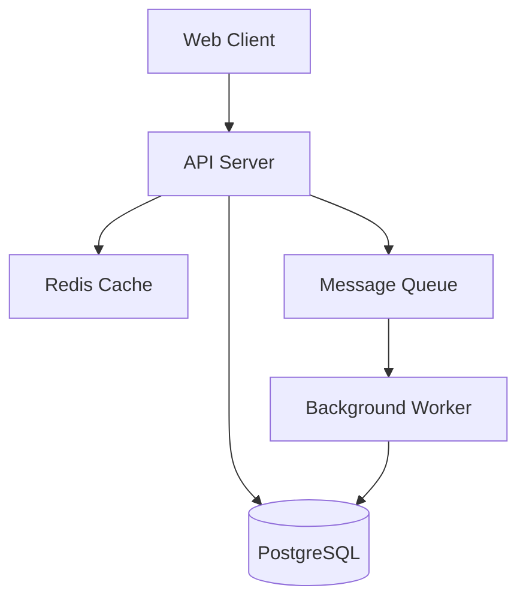
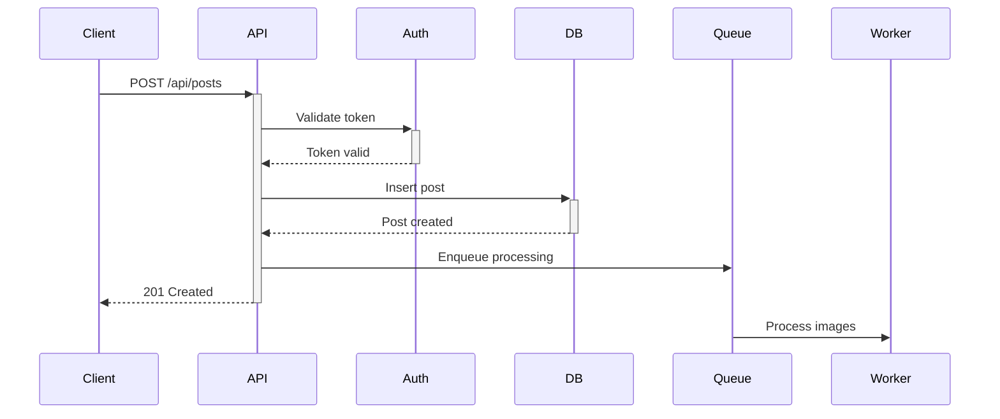
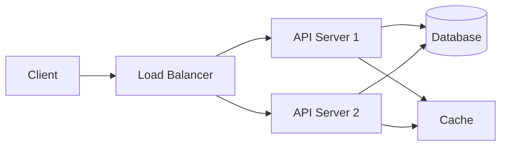
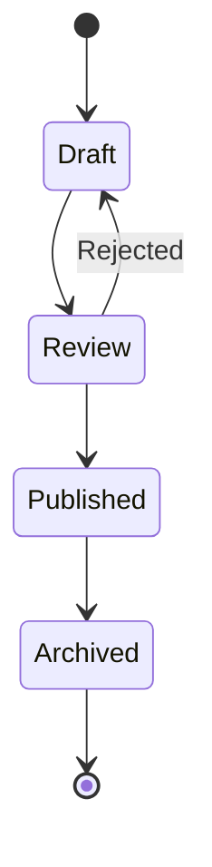

# Documentation Patterns

Common patterns for organizing and structuring documentation across all project types.

## Progressive Disclosure README

The README is the entry point. Structure it like a newspaper: most important information first, progressive depth.

### Structure

```markdown
# Project Name

One-sentence description of what this does and why it exists.

## Quick Start

[30-second version: install and run]

npm install my-project
node index.js

## What is This?

[2-minute explanation]
- What problem does this solve?
- Who is this for?
- What makes it different?

## Installation

[Detailed installation for all platforms]

## Usage

[Core usage patterns with examples]

## Documentation

- [Full documentation](./docs/)
- [API Reference](./docs/api.md)
- [Contributing Guide](./docs/contributing.md)

## License

[License information]
```

### Anti-Patterns to Avoid

❌ **Burying the quick start**
```markdown
# Project

[Long backstory about why project exists]
[Detailed technical architecture]
[Finally, 10 paragraphs down: how to install]
```

✅ **Quick start first**
```markdown
# Project

Solves X problem in Y way.

## Quick Start
npm install && npm start
```

❌ **Feature laundry list**
```markdown
Features:
- Feature 1
- Feature 2
- [50 more features]
```

✅ **Headline benefits**
```markdown
- Fast: 10x faster than alternatives
- Simple: 3 lines of code to get started
- Reliable: Used in production by [big names]
```

## API Endpoint Documentation

### Pattern: Per-Endpoint Detail

For each endpoint, document:

```markdown
### GET /api/users/:id

Retrieves a single user by ID.

**Parameters:**
- `id` (path, required): User ID

**Query Parameters:**
- `include` (optional): Related data to include. Options: `posts`, `comments`

**Request Headers:**
- `Authorization`: Bearer token required

**Response:** `200 OK`
```json
{
  "id": "123",
  "name": "John Doe",
  "email": "john@example.com",
  "posts": [...]
}
```

**Errors:**
- `401 Unauthorized`: Invalid or missing token
- `404 Not Found`: User does not exist

**Example:**
```bash
curl -H "Authorization: Bearer TOKEN" \
  https://api.example.com/api/users/123?include=posts
```
```

### Pattern: Resource Grouping

Group related endpoints:

```markdown
## Users Resource

### List Users
GET /api/users

### Get User
GET /api/users/:id

### Create User
POST /api/users

### Update User
PATCH /api/users/:id

### Delete User
DELETE /api/users/:id
```

## Command Documentation

### Pattern: Command Reference

```markdown
### myapp deploy

Deploys the application to production.

**Usage:**
```bash
myapp deploy [environment] [options]
```

**Arguments:**
- `environment` (optional): Target environment. Default: `production`

**Options:**
- `-f, --force`: Skip confirmation prompts
- `-v, --verbose`: Show detailed output
- `--dry-run`: Show what would be deployed without deploying

**Examples:**

Deploy to production:
```bash
myapp deploy production
```

Deploy to staging with verbose output:
```bash
myapp deploy staging --verbose
```

Dry run:
```bash
myapp deploy --dry-run
```
```

## Component Documentation

### Pattern: Component API

For React/Vue/other components:

```markdown
### UserCard

Displays user information in a card layout.

**Props:**

| Prop | Type | Required | Default | Description |
|------|------|----------|---------|-------------|
| user | User | Yes | - | User object to display |
| showEmail | boolean | No | false | Whether to show email |
| onEdit | function | No | - | Callback when edit clicked |

**Example:**
```jsx
<UserCard 
  user={user} 
  showEmail={true}
  onEdit={() => console.log('Edit clicked')}
/>
```

**Styling:**
- Accepts `className` prop for custom styling
- CSS variables: `--card-bg`, `--card-border`

**Accessibility:**
- Semantic HTML with proper heading hierarchy
- Keyboard navigation supported
- Screen reader friendly
```

## Architecture Documentation

### Pattern: System Overview

```markdown
# Architecture

## High-Level Design

[Mermaid diagram showing system components]



## Components

### API Server
- Express.js application
- Handles HTTP requests
- Implements business logic
- Manages authentication

### Database
- PostgreSQL 14
- Stores user data, posts, comments
- See [schema documentation](./schema.md)

### Cache Layer
- Redis for session storage and rate limiting
- 5-minute TTL on frequently accessed data

### Background Worker
- Processes asynchronous tasks
- Email sending, image processing
- Runs on separate server
```

### Pattern: Data Flow

```markdown
## Request Flow: Creating a Post

1. **Client** sends POST to `/api/posts`
2. **API Server** validates request
3. **API Server** checks authentication (Redis session)
4. **API Server** writes to database
5. **API Server** enqueues image processing job
6. **API Server** returns 201 Created
7. **Background Worker** processes images asynchronously
```

## Troubleshooting Documentation

### Pattern: Problem-Solution

```markdown
## Common Issues

### Database Connection Fails

**Symptom:**
```
Error: connect ECONNREFUSED 127.0.0.1:5432
```

**Cause:** PostgreSQL is not running or connection config is incorrect

**Solution:**
1. Verify PostgreSQL is running: `pg_isready`
2. Check connection string in `.env`
3. Ensure database exists: `createdb myapp_dev`

**Related:** See [Database Setup](./database.md)
```

### Pattern: Error Code Reference

```markdown
## Error Codes

### AUTH_001: Invalid Token

**When:** Token validation fails

**Common Causes:**
- Token has expired
- Token format is incorrect
- Token was revoked

**Resolution:**
1. Get a new token via `/api/auth/login`
2. Ensure token is passed in `Authorization` header
3. Check token expiration time

### RATE_001: Rate Limit Exceeded

**When:** Too many requests from same IP

**Common Causes:**
- Burst of requests
- Polling too frequently

**Resolution:**
- Wait for rate limit window to reset (shown in response headers)
- Implement exponential backoff
- Cache responses when possible
```

## Contributing Guide

### Pattern: Getting Started

```markdown
# Contributing

Thanks for your interest in contributing!

## Quick Start

1. Fork and clone
2. Install dependencies: `npm install`
3. Create branch: `git checkout -b my-feature`
4. Make changes
5. Run tests: `npm test`
6. Push and create PR

## Development Setup

### Prerequisites
- Node.js 18+
- PostgreSQL 14+
- Redis 6+

### Environment Setup
1. Copy `.env.example` to `.env`
2. Update database credentials
3. Run migrations: `npm run migrate`
4. Seed test data: `npm run seed`

## Code Style

We use ESLint and Prettier:
- Run linter: `npm run lint`
- Format code: `npm run format`

## Testing

- Unit tests: `npm run test:unit`
- Integration tests: `npm run test:integration`
- All tests must pass before PR

## Pull Request Process

1. Update documentation if needed
2. Add tests for new features
3. Ensure all tests pass
4. Update CHANGELOG.md
5. Request review from maintainers
```

## Installation Documentation

### Pattern: Multi-Platform Installation

```markdown
## Installation

### macOS

```bash
brew install myapp
```

### Linux

**Debian/Ubuntu:**
```bash
curl -fsSL https://example.com/install.sh | bash
```

**Arch Linux:**
```bash
yay -S myapp
```

### Windows

**Using npm:**
```bash
npm install -g myapp
```

**Using installer:**
Download from [releases page](https://github.com/user/myapp/releases)

### From Source

```bash
git clone https://github.com/user/myapp.git
cd myapp
npm install
npm run build
npm link
```

### Verify Installation

```bash
myapp --version
```

Should output: `myapp v1.2.3`
```

## Configuration Documentation

### Pattern: Configuration Reference

```markdown
## Configuration

### Environment Variables

| Variable | Required | Default | Description |
|----------|----------|---------|-------------|
| DATABASE_URL | Yes | - | PostgreSQL connection string |
| REDIS_URL | No | localhost:6379 | Redis connection string |
| PORT | No | 3000 | Server port |
| LOG_LEVEL | No | info | Logging level (debug, info, warn, error) |

### Config File

Create `config.yml`:

```yaml
server:
  port: 3000
  host: 0.0.0.0

database:
  host: localhost
  port: 5432
  name: myapp
  
cache:
  enabled: true
  ttl: 300
```

### Config Priority

1. Environment variables (highest priority)
2. Config file
3. Defaults (lowest priority)

**Example:** `PORT` env var overrides `server.port` in config file
```

## Deployment Documentation

### Pattern: Deployment Guide

```markdown
## Deployment

### Prerequisites
- Server with Ubuntu 20.04+
- Docker and Docker Compose
- Domain name pointing to server

### Quick Deploy

1. Clone repository:
```bash
git clone https://github.com/user/myapp.git
cd myapp
```

2. Set environment variables:
```bash
cp .env.example .env
nano .env  # Edit as needed
```

3. Deploy with Docker:
```bash
docker-compose up -d
```

4. Run migrations:
```bash
docker-compose exec api npm run migrate
```

5. Verify:
```bash
curl https://yourdomain.com/health
```

### Production Checklist

- [ ] Set `NODE_ENV=production`
- [ ] Use strong database password
- [ ] Configure SSL/TLS
- [ ] Set up backups
- [ ] Configure monitoring
- [ ] Set up logging
```

## Migration Guide

### Pattern: Version Migration

```markdown
## Migrating from v1 to v2

### Breaking Changes

#### Database Schema
Users table renamed to `accounts`:

**Before (v1):**
```sql
SELECT * FROM users WHERE id = 1;
```

**After (v2):**
```sql
SELECT * FROM accounts WHERE id = 1;
```

#### API Changes
Authentication endpoint changed:

**Before (v1):**
```
POST /auth/login
```

**After (v2):**
```
POST /api/v2/auth/token
```

### Migration Steps

1. **Backup your database**
```bash
pg_dump myapp > backup.sql
```

2. **Update code**
```bash
git pull origin main
npm install
```

3. **Run migrations**
```bash
npm run migrate:v2
```

4. **Update environment variables**
- Add: `API_VERSION=v2`
- Remove: `LEGACY_MODE=true`

5. **Restart application**
```bash
pm2 restart myapp
```

6. **Verify**
```bash
curl https://api.example.com/health
```

### Rollback

If needed:
```bash
git checkout v1.x.x
npm run migrate:down
pm2 restart myapp
```
```

## Cross-References and Linking

### Pattern: Internal Links

```markdown
## Authentication

All API endpoints require authentication. See [Authentication Guide](./auth.md) for details.

### Quick Example

```bash
curl -H "Authorization: Bearer TOKEN" \
  https://api.example.com/users
```

For full authentication flow, see [Auth Flow Diagram](./auth.md#flow-diagram).
```

### Pattern: External Links

```markdown
## Dependencies

This project uses:
- [Express.js](https://expressjs.com/) - Web framework
- [PostgreSQL](https://www.postgresql.org/) - Database
- [Redis](https://redis.io/) - Cache and sessions

See [package.json](../package.json) for full dependency list.
```

## Examples Documentation

### Pattern: Progressive Examples

```markdown
## Examples

### Basic Usage

Simplest possible example:

```javascript
const app = require('myapp');
app.start();
```

### Common Pattern

Most users do this:

```javascript
const app = require('myapp');

app.configure({
  port: 3000,
  database: process.env.DATABASE_URL
});

app.start();
```

### Advanced Usage

For complex scenarios:

```javascript
const app = require('myapp');

app.use(customMiddleware());

app.configure({
  port: 3000,
  database: {
    host: 'localhost',
    pool: { min: 2, max: 10 }
  },
  cache: {
    enabled: true,
    strategy: 'lru'
  }
});

app.on('ready', () => {
  console.log('App is running');
});

app.start();
```

### Real-World Example

Complete application:

```javascript
// See /examples/complete-app.js for full runnable code
```
```

## Diagrams and Visuals

### Pattern: Mermaid Diagrams

**Sequence Diagram:**
```markdown

```

**Architecture Diagram:**
```markdown

```

**State Diagram:**
```markdown

```
